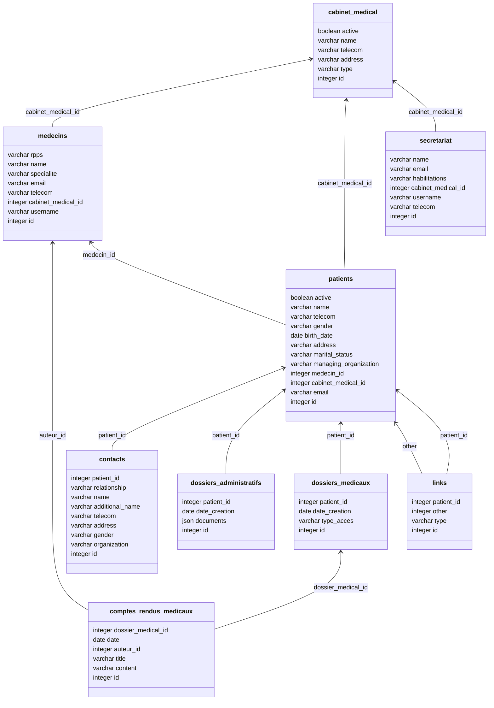

```mermaid
classDiagram
direction BT

class cabinet_medical {
   boolean active
   varchar name
   varchar telecom
   varchar address
   varchar type
   integer id
}
class comptes_rendus_medicaux {
   integer dossier_medical_id
   date date
   integer auteur_id
   varchar title
   varchar content
   integer id
}
class contacts {
   integer patient_id
   varchar relationship
   varchar name
   varchar additional_name
   varchar telecom
   varchar address
   varchar gender
   varchar organization
   integer id
}
class dossiers_administratifs {
   integer patient_id
   date date_creation
   json documents
   integer id
}
class dossiers_medicaux {
   integer patient_id
   date date_creation
   varchar type_acces
   integer id
}
class links {
   integer patient_id
   integer other
   varchar type
   integer id
}
class medecins {
   varchar rpps
   varchar name
   varchar specialite
   varchar email
   varchar telecom
   integer cabinet_medical_id
   varchar username
   integer id
}
class patients {
   boolean active
   varchar name
   varchar telecom
   varchar gender
   date birth_date
   varchar address
   varchar marital_status
   varchar managing_organization
   integer medecin_id
   integer cabinet_medical_id
   varchar email
   integer id
}
class secretariat {
   varchar name
   varchar email
   varchar habilitations
   integer cabinet_medical_id
   varchar username
   varchar telecom
   integer id
}

comptes_rendus_medicaux --> dossiers_medicaux : dossier_medical_id
comptes_rendus_medicaux --> medecins : auteur_id
contacts --> patients : patient_id
dossiers_administratifs --> patients : patient_id
dossiers_medicaux --> patients : patient_id
links --> patients : other
links --> patients : patient_id
medecins --> cabinet_medical : cabinet_medical_id
patients --> cabinet_medical : cabinet_medical_id
patients --> medecins : medecin_id
secretariat --> cabinet_medical : cabinet_medical_id
```