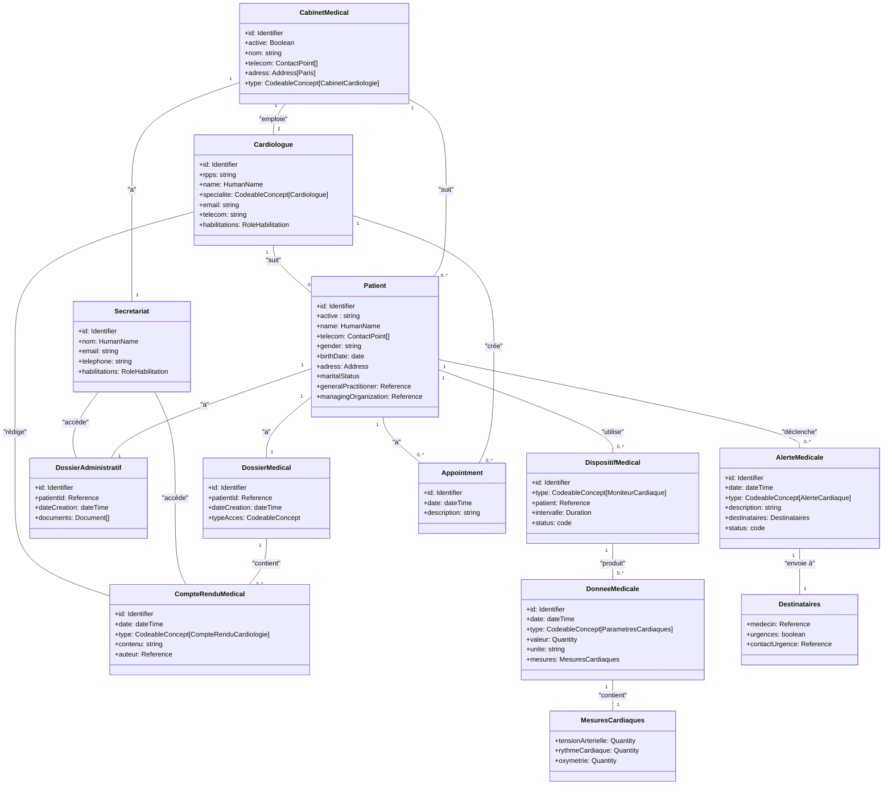

# Mermaid Editor

## Usage

```mermaid
classDiagram
    class CabinetMedical {
        +id: Identifier
        +active: Boolean
        +nom: string
        +telecom: ContactPoint[]
        +adress: Address[Paris]
        +type: CodeableConcept[CabinetCardiologie]
    }

    class Cardiologue {
        +id: Identifier
        +rpps: string
        +name: HumanName
        +specialite: CodeableConcept[Cardiologue]
        +email: string
        +telecom: string
        +habilitations: RoleHabilitation
    }

    class Secretariat {
        +id: Identifier
        +nom: HumanName
        +email: string
        +telephone: string
        +habilitations: RoleHabilitation
    }

    class Patient {
        +id: Identifier
        +active : string
        +name: HumanName
        +telecom: ContactPoint[]
        +gender: string
        +birthDate: date
        +adress: Address
        +maritalStatus
        +generalPractitioner: Reference
        +managingOrganization: Reference
    }

    class DossierMedical {
        +id: Identifier
        +patientId: Reference
        +dateCreation: dateTime
        +typeAcces: CodeableConcept
    }

    class DossierAdministratif {
        +id: Identifier
        +patientId: Reference
        +dateCreation: dateTime
        +documents: Document[]
    }

    class CompteRenduMedical {
        +id: Identifier
        +date: dateTime
        +type: CodeableConcept[CompteRenduCardiologie]
        +contenu: string
        +auteur: Reference
    }

    class DispositifMedical {
        +id: Identifier
        +type: CodeableConcept[MoniteurCardiaque]
        +patient: Reference
        +intervalle: Duration
        +status: code
    }

    class DonneeMedicale {
        +id: Identifier
        +date: dateTime
        +type: CodeableConcept[ParametresCardiaques]
        +valeur: Quantity
        +unite: string
        +mesures: MesuresCardiaques
    }

    class MesuresCardiaques {
        +tensionArterielle: Quantity
        +rythmeCardiaque: Quantity
        +oxymetrie: Quantity
    }

    class AlerteMedicale {
        +id: Identifier
        +date: dateTime
        +type: CodeableConcept[AlerteCardiaque]
        +description: string
        +destinataires: Destinataires
        +status: code
    }

    class Destinataires {
        +medecin: Reference
        +urgences: boolean
        +contactUrgence: Reference
    }

    class Appointment {
        +id: Identifier
        +date: dateTime
        +description: string
    }

    CabinetMedical "1" -- "2" Cardiologue : "emploie"
    CabinetMedical "1" -- "1" Secretariat : "a"
    CabinetMedical "1" -- "0..*" Patient : "suit"
    Cardiologue "1" -- "0..*" Patient : "suit"
    Patient "1" -- "1" DossierMedical : "a"
    Patient "1" -- "1" DossierAdministratif : "a"
    DossierMedical "1" -- "0..*" CompteRenduMedical : "contient"
    Patient "1" -- "0..*" DispositifMedical : "utilise"
    DispositifMedical "1" -- "0..*" DonneeMedicale : "produit"
    DonneeMedicale "1" -- "1" MesuresCardiaques : "contient"
    Patient "1" -- "0..*" AlerteMedicale : "déclenche"
    AlerteMedicale "1" -- "1" Destinataires : "envoie à"
    Secretariat -- DossierAdministratif : "accède"
    Secretariat -- CompteRenduMedical : "accède"
    Cardiologue -- CompteRenduMedical : "rédige"
    Cardiologue "1" -- "0..*" Appointment : "crée"
    Patient "1" -- "0..*" Appointment : "a"
```