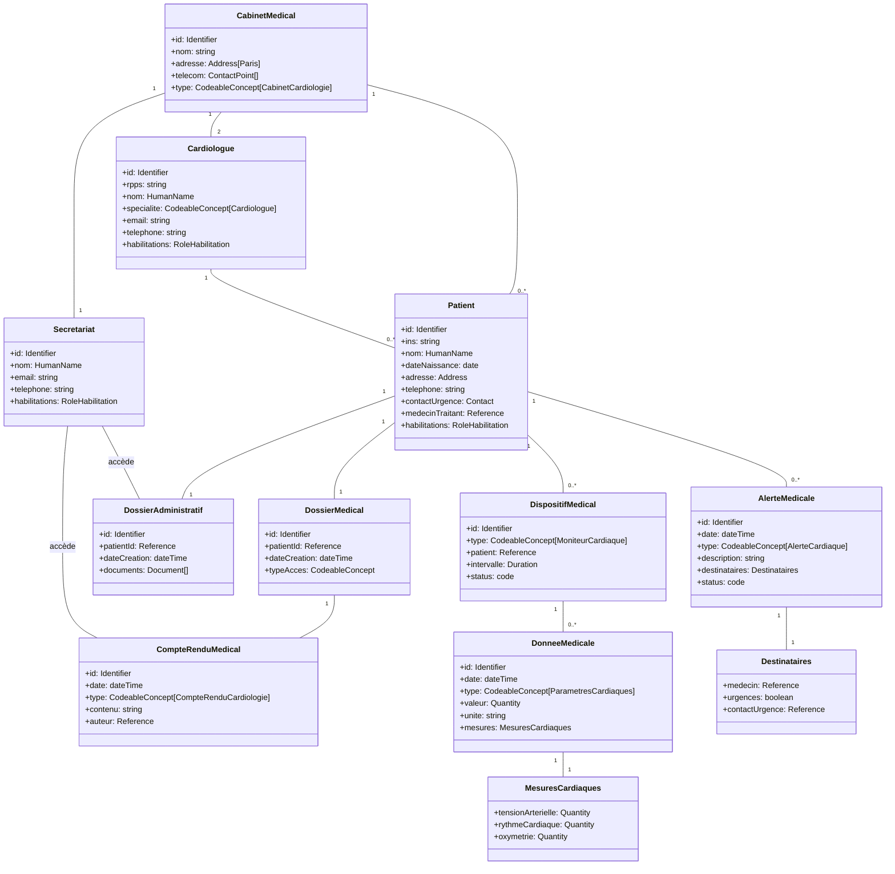

# Mermaid Editor

## Usage

```mermaid
classDiagram
    class CabinetMedical {
        +id: Identifier
        +nom: string
        +adresse: Address[Paris]
        +telecom: ContactPoint[]
        +type: CodeableConcept[CabinetCardiologie]
    }

    class Cardiologue {
        +id: Identifier
        +rpps: string
        +nom: HumanName
        +specialite: CodeableConcept[Cardiologue]
        +email: string
        +telephone: string
        +habilitations: RoleHabilitation
    }

    class Secretariat {
        +id: Identifier
        +nom: HumanName
        +email: string
        +telephone: string
        +habilitations: RoleHabilitation
    }

    class Patient {
        +id: Identifier
        +ins: string
        +nom: HumanName
        +dateNaissance: date
        +adresse: Address
        +telephone: string
        +contactUrgence: Contact
        +medecinTraitant: Reference
        +habilitations: RoleHabilitation
    }

    class DossierMedical {
        +id: Identifier
        +patientId: Reference
        +dateCreation: dateTime
        +typeAcces: CodeableConcept
    }

    class DossierAdministratif {
        +id: Identifier
        +patientId: Reference
        +dateCreation: dateTime
        +documents: Document[]
    }

    class CompteRenduMedical {
        +id: Identifier
        +date: dateTime
        +type: CodeableConcept[CompteRenduCardiologie]
        +contenu: string
        +auteur: Reference
    }

    class DispositifMedical {
        +id: Identifier
        +type: CodeableConcept[MoniteurCardiaque]
        +patient: Reference
        +intervalle: Duration
        +status: code
    }

    class DonneeMedicale {
        +id: Identifier
        +date: dateTime
        +type: CodeableConcept[ParametresCardiaques]
        +valeur: Quantity
        +unite: string
        +mesures: MesuresCardiaques
    }

    class MesuresCardiaques {
        +tensionArterielle: Quantity
        +rythmeCardiaque: Quantity
        +oxymetrie: Quantity
    }

    class AlerteMedicale {
        +id: Identifier
        +date: dateTime
        +type: CodeableConcept[AlerteCardiaque]
        +description: string
        +destinataires: Destinataires
        +status: code
    }

    class Destinataires {
        +medecin: Reference
        +urgences: boolean
        +contactUrgence: Reference
    }

    CabinetMedical "1" -- "2" Cardiologue
    CabinetMedical "1" -- "1" Secretariat
    CabinetMedical "1" -- "0..*" Patient
    Cardiologue "1" -- "0..*" Patient
    Patient "1" -- "1" DossierMedical
    Patient "1" -- "1" DossierAdministratif
    DossierMedical "1" -- "0..*" CompteRenduMedical
    Patient "1" -- "0..*" DispositifMedical
    DispositifMedical "1" -- "0..*" DonneeMedicale
    DonneeMedicale "1" -- "1" MesuresCardiaques
    Patient "1" -- "0..*" AlerteMedicale
    AlerteMedicale "1" -- "1" Destinataires
    Secretariat -- DossierAdministratif : accède
    Secretariat -- CompteRenduMedical : accède
```